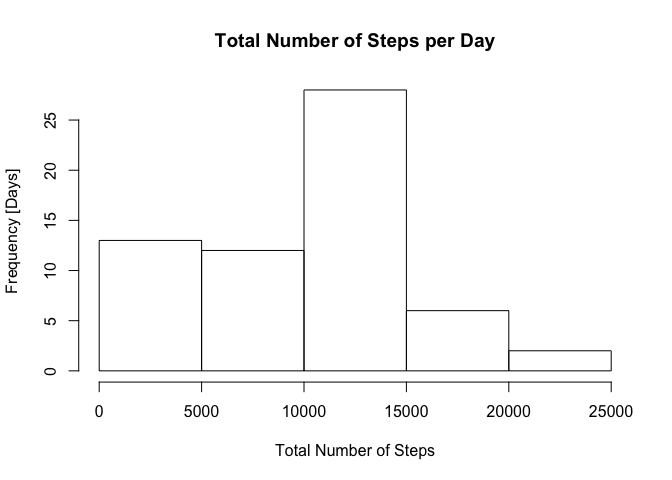
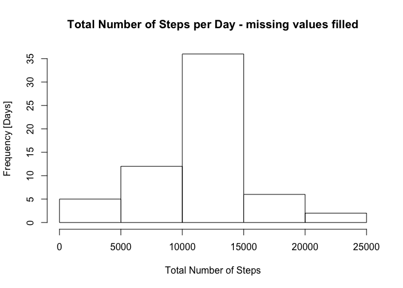

# Assignment Reproducible Research Week 2

### Data Processing

Read in data and convert dates from a character format to a date format.


```r
act <- read.csv(unzip("activity.zip"))
act$date <- as.Date(act$date)
```

##Results

### What is the mean total number of steps taken per day?

Load the plyr package and calculate the total number of steps per day (ignoring missing values). Generate a histogram, showing the total number of steps per day.  
Calculate the mean and median of the total number of steps taken per day.


```r
library(plyr)
day <- ddply(act,.(date),summarize, sum=sum(steps, na.rm=T))

hist(day$sum, xlab = "Total Number of Steps", ylab="Frequency [Days]", main="Total Number of Steps per Day")
```

<!-- -->

```r
mean(day$sum)
```

```
## [1] 9354.23
```

```r
median(day$sum)
```

```
## [1] 10395
```

The mean of the total number of steps taken per day is 9354, the median is 10395.

## What is the average daily activity pattern?

Calculate the mean number of steps taken across all days per interval (ignoring missing values). Assign names and means to two vectors (Interval and Steps) and combine the two vectors into a data frame. Plot Steps vs Interval with ggplot (add a blue line, white background, remove grid lines, add axes label and title).  
Display the interval with the maximum number of steps.


```r
Interval <- as.numeric(names(tapply(act$steps, act$interval, mean, na.rm=T)))
Steps <- as.numeric(tapply(act$steps, act$interval, mean, na.rm=T))
times <- as.data.frame(cbind(Interval, Steps))

library(ggplot2)
ggplot(times, aes(Interval, Steps)) +
    geom_line(col="dodgerblue") +
    theme_bw() +
    theme(panel.grid = element_blank()) +
    labs(x = "Interval", y = "Number of steps", title = "Average number of steps across all days")
```

<!-- -->

```r
times[(times$Steps==max(times$Steps)),][1]
```

```
##     Interval
## 104      835
```

The 5-minute interval 835 contains the maximum number of steps.

## Imputing missing values

Select lines with missing values and display for how many entries there are missing values.  
With a for loop, replace the missing values with the mean number of steps of the corresponding interval. Combine non-missing values and missing values (which have now been filled) into a new dataframe, act_new. Generate a histogram, showing the total number of steps taken per day.  
Calculate the mean and median of the total number of steps taken per day: both increased compared to the original dataset.  
Subtract the mean and median calculated on the original dataset from the new mean and median to get the difference.


```r
act_na <- act[(is.na(act$steps)),] 
dim(act_na) [1]
```

```
## [1] 2304
```

```r
for (i in 1:length(act_na$date)) {
    x <- act_na$interval[i]
    y <- mean(act[(act$interval==x),1], na.rm=T)
    act_na$steps[i] <- y  
}
act_new <- rbind(act_na, act[!(rownames(act)%in%rownames(act_na)),])
day_new <- ddply(act_new,.(date),summarize, sum=sum(steps))

hist(day_new$sum, xlab = "Total Number of Steps", ylab="Frequency [Days]", main="Total Number of Steps per Day - missing values filled")
```

<!-- -->

```r
mean(day_new$sum) 
```

```
## [1] 10766.19
```

```r
median(day_new$sum) 
```

```
## [1] 10766.19
```

```r
mean(day_new$sum) - mean(day$sum)
```

```
## [1] 1411.959
```

```r
median(day_new$sum) - median(day$sum)
```

```
## [1] 371.1887
```

2304 values are missing in the dataset.  
  
When replacing missing values, the mean and the median of the total number of steps taken increased by 1412 and 371 steps, respectively.

## Are there differences in activity patterns between weekdays and weekends?

Add the weekday information to the dataframe and split the dataframe according to weekend/weekday. 
Calculate the mean number of steps per interval across all weekend days. Assign the interval names to a vector called Interval. Assign the mean number of steps to a vector called Steps. Combine those two vectors into a dataframe termed wknd and add a character vector specifying that those values are weekend values. Do the same for the weekday dataset, generating the dataframe wkd.  
Combine the two dataframes wknd and wkd into the dataframe times_new.  
Plot Steps vs Interval for weekends and weekdays (using facet_wrap) with ggplot (add a blue line, white background, add a yellow title background, remove grid lines, add axes labels).


```r
act_new$weekday <- weekdays(act$date)
weekend <- act_new[(act_new$weekday=="Saturday")|(act_new$weekday=="Sunday"),]
weekday <- act_new[!(rownames(act_new)%in%rownames(weekend)),]

Interval <- as.numeric(names(tapply(weekend$steps, weekend$interval, mean)))
Steps <- as.numeric(tapply(weekend$steps, weekend$interval, mean))
wknd <- as.data.frame(cbind(Interval, Steps))
wknd$Day <- rep("weekend", dim(wknd)[1])

Steps <- as.numeric(tapply(weekday$steps, weekday$interval, mean))
wkd <- as.data.frame(cbind(Interval, Steps))
wkd$Day <- rep("weekday", dim(wkd)[1])

times_new <- arrange(transform(rbind(wknd, wkd), Day = factor(Day, levels = c("weekend", "weekday"))),Day)

ggplot(times_new, aes(Interval, Steps)) +
    geom_line(col="dodgerblue") +
    theme_bw() +
    facet_wrap(~ Day, ncol=1) +
    theme(strip.background = element_rect(fill = "papayawhip"), panel.grid = element_blank()) +
    xlab("Interval") +
    ylab("Number of steps")
```

<!-- -->

Yes - the activity pattern differs between weekend and weekdays. People seem to be overall more active on the weekend, and the curve seems to be shifted to the right (i.e. people start to be active later in the morning and stay more active later at night).
